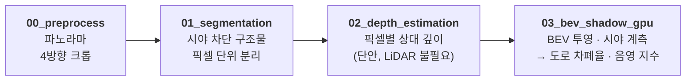
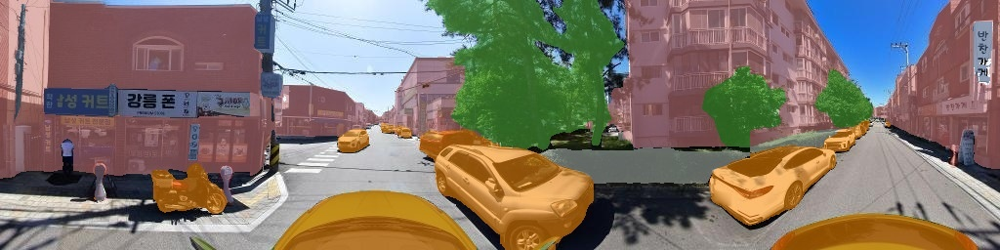
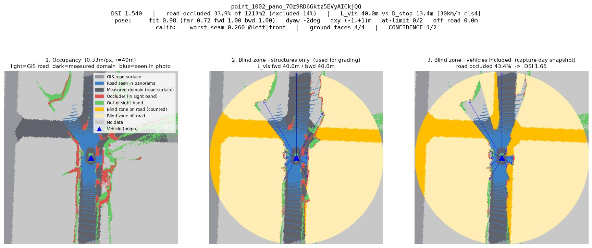

<div align="center">

**[5kph] 2026 강릉 ITS 세계총회 유스펠로우쉽**

# 안전성·수요 기반 특수 이벤트 기간 자율주행 셔틀 노선 설계를 위한 도로 음영 지수 모델

**도로 위험도 웹 지도 → [its-2026.vercel.app](https://its-2026.vercel.app/)**
분석지 도로망의 도로 위험도 등급과 지점별 진단 결과를 지도에서 바로 확인하실 수 있습니다.

</div>

---

## 프로젝트 요약

강릉시의 네이버 스트리트뷰 사진 36,367장에 대해 컴퓨터 비전으로 자율주행차가 도로를 얼마나 볼 수 있는지를 지점마다 계측하고(정적 도로 음영 지수), 여기에 통행량·차량 점유 같은 동적 조건(동적 항)을 결합해 자율주행 셔틀 노선의 사전 안전성을 진단합니다. 최종적으로는 특수 이벤트 기간 수요 시나리오와 함께 놓아 안전성과 수요를 모두 고려한 노선 후보를 제시하는 것을 목표로 합니다.

---

## 아이디어 필요성

HD·LiDAR 기반 3D 매핑은 구축 비용이 크고 갱신 주기가 길어 강릉시 전역이나 벽지노선형까지 반복 적용하기 어렵습니다. 공개된 스트리트뷰 사진을 사용하는 해당 모델은 그 제약 없이 전 구간을 한 번에 훑습니다.

산출된 도로 음영 지수는 구간별 위험도를 매길 수 있으므로 고위험 구간을 회피하는 대안 노선이나 신규 노선을 직접 제안할 수 있어, 노선 계획자가 안전성 제고와 노선 설계라는 목표를 동시에 추진할 근거가 됩니다.

본 프로젝트는 사고를 예측하는 대신, **도로가 자율주행차에게 보이는가**를 직접 측정하고 **교통량과 같은 동적 항**을 결합하여 시기 별로 도로의 위험도를 판단합니다. 공개된 스트리트뷰 사진만으로 전 구간에서 계측되며, 노선 계획 단계에서 바로 적용할 수 있습니다.

사람 운전자는 시야가 가려져도 경험과 예측으로 상당 부분 보완하지만, 센서 기반 주행은 그렇지 않습니다. 그래서 "이 도로가 자율주행차의 센서에 보이는가"는 사람이 운전해 낸 사고 기록으로 답할 수 없는 조건이고, 이 지수는 사고 예측이 아니라 **운행 요건**을 판별합니다. — 사고가 한 건도 없는 도로에서도 위험도 값이 나오고, 그 값은 "여기서는 40 m 이내 도로의 몇 %가 보이지 않는다"를 뜻합니다.

---


## 전체 구성과 본 저장소의 범위

<div align="center">

| 단계 | 내용 | 본 저장소 |
|:---:|:---|:---:|
| **1** | 시맨틱 세그멘테이션 기반 정적 인프라 객체 분리 | ● 구현 |
| **2** | 단안 깊이 추정을 통한 거리 정보 복원 | ● 구현 |
| **3** | BEV 투영 및 사각지대 정량 계측 | ● 구현 |
| **4** | 정적 도로 음영 지수 산출 | ● 구현 |
| **5** | **동적 조건 결합** — 통행량 · 차량 점유 | ● 구현 |
| 6 | 관광 수요 시나리오 | ○ 미구현 |
| 7 | 안전성·수요 결합 그래프 기반 노선 최적화 | ○ 미구현 |

</div>

**1~5단계가 안전성 축**이고 본 저장소의 구현 범위입니다. 최종 산출물은 도로망 각 구간의 결합 지수이며, 이것이 7단계 노선 최적화의 엣지 가중치로 투입됩니다.


### 입력 데이터

| 구분 | 내용 |
|:---|:---|
| **스트리트뷰** | 네이버 로드뷰 파노라마 API, 분석지 전 도로망 5m 간격, **36,367지점** |
| **도로망** | 실폭도로 폴리곤 + 도로구간 중심선(노드화·5m 조밀화), EPSG:5179 |
| **표준노드링크** | 국가교통 노드·링크 (링크 4,697 · 412km) — 동적 결합의 단위 |
| **교차로 통행량** | 강릉시 도시정보센터, 2025-05~2026-07 (15개월). 수집 104개소 중 스트리트뷰 커버리지를 만족하는 **75개소** 사용 |
| **이벤트 기간 통행량** | 위에서 잘라낸 **강릉단오제** 2025-05-27~06-03 · 2026-06-15~06-22 (각 8일) — 동적 항에 실제로 쓰는 값 |
| **사고 자료** | TAAS 원시 사고지점, 2024~25년 **중상 이상 216건** — 가중치 보정용 |

---

## 도로 음영 지수


정적 도로 음영 지수는 위험 예측 지표가 아니라 **운행 요건 지표**입니다. 정적 도로 음영 지수가 계산하는 것은 문자 그대로 "시거 안에서 도로면이 얼마나 가려져 있는가"입니다. 자율주행차는 센서 및 카메라 시야에 의존하므로, 도로가 보이지 않는다는 것은 운행 제약이 됩니다.

이 구분이 중요한 이유는 **정적 도로 음영 지수는 사고가 많은 곳에서 오히려 낮게 나오기 때문**입니다.

<div align="center">

| 사고 유형 | 음영 지수 계수 | 해석 |
|:---|---:|:---|
| 차대차 × 교차로 | **−3.10** | 넓은 간선 교차로 |
| 차대차 | −2.45 | |
| **차대사람** | **+0.20** | 관계가 사라짐 |
| 단일로 | +0.08 | |

</div>

<sub>*2024~25년 강릉시 중상 이상 사고 216건, 포아송 회귀, 계측점 군집 강건 표준오차. 탐색적 분석입니다.*</sub>

넓은 간선 교차로에서 나는 차대차 사고의 기전은 집중되는 통행량과 속도·신호·좌회전 상충이지 시야 차폐가 아닙니다. 그리고 넓은 간선 교차로는 트여 있어서 정적 도로 음영 지수가 낮습니다.
그리고 이것이 동적 항이 필요한 이유입니다. 정적도로 음영 지수는 **도로의 구조적인 위험도**를, 동적 항은 **교통량과 같이 여기서 무슨 일이 일어나는가**를 측정합니다.

---

## 도로 음영 지수 산출 파이프라인



각 단계는 주피터 노트북 하나에 대응하며, 앞 단계의 산출 파일을 뒷 단계가 입력으로 받습니다.

<br/>

### 0단계 — 파노라마 전처리 (`00_preprocess.ipynb`)

360° 파노라마는 좌·정면·우·후방·바닥·하늘 순으로 수평 6등분되어 있습니다. 이 중 시야 분석에 쓰이는 앞의 네 구간(각 90°)만 잘라 내어 방향별 크롭 이미지로 저장합니다. 인식 모델은 원근 투영 영상으로 학습되어 있어, 왜곡이 큰 등장방형 원본보다 90° 핀홀 크롭에서 정확도가 높습니다.

> 파노라마 36,367장 → 방향별 크롭 145,468장
>
> 원본 파노라마 예시 이미지는 [네이버 스트리트뷰 파노라마](https://panorama.pstatic.net/image/7Oz9RD6Gktz5EVyAICkjQQ/512/P)에서 직접 확인하실 수 있습니다.

<br/>

### 1단계 — 시맨틱 세그멘테이션 (`01_segmentation.ipynb`)

ADE20K(150클래스) 기반 **Mask2Former Swin-Large**로 각 크롭을 픽셀 단위 분류하고, 도로 맥락에 맞추어 세 계열의 마스크로 나눕니다.

| 마스크 | 대상 클래스 | 역할 |
|:---|:---|:---|
| **시야 차단 구조물** | 건물·벽·담장·가로수·기둥·표지판 등 **32종** | 사각지대를 만드는 주체 |
| **지면·하늘** | 도로·보도·잔디·하늘 등 | 시야를 막지 않음. 3단계 metric 보정의 기준면 |
| **차량** | 승용차·버스·트럭·이륜차 등 | 별도 마스크로 분리 보관 |

차량을 구조물과 분리하는 이유는 두 값의 성격이 다르기 때문입니다. **구조물만을 센 값**은 촬영일 교통과 무관한 그 장소의 구조적 속성이므로 **정적 도로 음영 지수**가 되고, **차량까지 포함한 값**은 촬영 순간의 스냅숏이므로 5단계에서 **동적 항의 재료**로 씁니다(성격과 한계는 5단계 참조).

<p align="center">
  
</p>

<sub>*(예시) 방향별 세그멘테이션 결과를 좌·정면·우·후방 순으로 이어붙인 사진. 건물·가로수 등 시야 차단 구조물은 클래스별 색으로, 차량은 주황색으로 표시됩니다.*</sub>

<br/>

### 2단계 — 단안 깊이 추정 (`02_depth_estimation.ipynb`)

**Depth Anything V2 Large**로 픽셀별 깊이 단서를 복원합니다. LiDAR 없이 공개 이미지만으로 거리 정보를 얻는 것이 본 파이프라인의 비용 우위를 만드는 지점입니다.

모델 출력은 값이 클수록 가까운 이격값이며, 추론 1회마다 미지의 (scale, shift)를 갖는 아핀 불변량입니다. 즉 이 단계의 결과는 "어느 쪽이 더 가까운가"까지만 말해 주고 절대 거리는 아직 확정되지 않습니다. 따라서 중간 정규화 없이 원출력을 float16으로 그대로 저장하고, 미터 환산은 3단계에서 기하 제약으로 해결합니다.

<p align="center">
  
</p>

<sub>*(예시) 같은 지점의 방향별 깊이 시각화. 어두울수록 가깝고 밝을수록 멉니다. 화면 하단의 짙은 영역은 촬영 차량의 보닛입니다.*</sub>

<br/>

### 3단계 — BEV 투영 및 시야 계측 (`03_bev_shadow_gpu.ipynb`)

앞의 두 단계가 "무엇이 찍혔는가"와 "어느 쪽이 더 가까운가"를 알려 주었다면, 이 단계는 그것을 실제 미터 단위의 평면도로 바꿉니다. 그 지점 위에서 내려다본 조감도(BEV, Bird's Eye View)를 그리고, 그 위에서 **차에서 보이지 않는 도로가 얼마나 되는지**를 잽니다.

**① 미터로 환산하기.**
2단계 결과는 아직 배율이 정해지지 않은 상대값이므로, 실제 거리로 되돌릴 단서가 필요합니다. 여기에는 다음 두 가지 내용을 이용합니다. 첫째, **카메라 높이를 알면 화면 속 바닥이 몇 미터 앞인지 삼각측량으로 계산됩니다.** 둘째, **네 방향 사진이 맞닿는 이음매에서는 같은 물체가 양쪽에서 같은 거리로 나와야 합니다.** 이 두 조건을 동시에 만족하는 환산식을 파노라마 한 장마다 풀어, 네 면이 서로 어긋나지 않는 하나의 좌표계로 묶습니다. 카메라 높이는 추정하지 않고 **전 지점 공통 2.5 m** 를 씁니다. (고도가 정밀하게 기록된 촬영분은 전부 정확히 2.5 m 입니다.)

**② 시야를 막는 것만 고르기.**
화면에 잡힌 모든 물체가 운전 시야를 가리는 것은 아닙니다. 그래서 **지면에서 1.0~3.0 m 높이**를 차지하는 것만 차단물로 인정합니다. 연석이나 낮은 화단은 그 너머가 보이고, 가로수의 우산처럼 퍼진 윗부분은 시선 위로 지나가기 때문입니다.

**③ 360° 시야 재기.**
카메라를 중심으로 원을 **720갈래(0.5° 간격)** 로 나누고, 각 갈래마다 시야가 처음 막히는 지점까지의 거리를 기록합니다. 제자리에서 레이저 거리계를 한 바퀴 돌린 것과 같으며, 결과는 방향별 가시거리 720개의 목록입니다. 이후 모든 지표는 이 목록 하나에서 나옵니다.

**④ 실제 도로 위에 얹기.**
파노라마 사진만 이용하여 복원한 도로면 지도를 만들고, GIS 실폭도로 폴리곤과 겹쳐 카메라의 위치·바라보는 방향 오차를 먼저 바로잡습니다. 그런 다음 **도로면을 따라 걸어서 40 m 이내**에 닿는 도로 면적만 계측 대상으로 삼습니다. 직선거리가 아니라 도로를 따라간 거리를 쓰는 이유는, 건물 뒤편처럼 애초에 차가 다니지 않는 곳까지 "안 보이는 영역"으로 세면 위험도가 부풀려지기 때문입니다. (건물 뒷쪽 마당이 자율주행 차량이 지나가는 건물 앞면 도로에서 보이지 않는 건 자율주행 차량 관점에서 위험이 아닙니다.) 또한 계측 대상을 도로 **중심선**이 아니라 **면적**으로 잡습니다.

**⑤ 계측.**
계측 대상 도로면 중 ③의 시야에 가려지는 **면적의 비율**이 **도로 차폐율**이고, 정면·후방으로 시선이 처음 막히는 거리가 **유효 가시거리 `L_vis`** 입니다.

**⑥ 믿을 수 있는 결과만 사용.**
바닥이 거의 보이지 않아 ①의 환산이 성립하지 않는 경우, 앞차에 가려 도로의 절반 이상을 아예 관측하지 못한 경우, ④에서 카메라가 GIS 도로 지도 밖으로 5 m 넘게 벗어나 무엇을 쟀는지 알 수 없는 경우에는 값을 산출하지 않고 **판정 불가**로 남깁니다. 최신 판(260820) 기준 산출 35,995지점 중 **34,724지점(96.5%)이 유효**하고 1,271지점(3.5%)이 판정 불가입니다.

<p align="center">
  
</p>

<sub>*(예시) 왼쪽부터 (1) 조감도 — 연한 회색은 GIS 실폭도로, **진한 회색은 차폐율을 세는 대상 도로면**, 파랑은 파노라마 사진으로만 재현한 도로면입니다. 진한 회색과 파랑이 잘 겹칠수록 위치 보정이 잘된 경우이고, 파랑 없이 진한 회색만 남은 곳이 *재려고 했으나 보이지 않은* 도로입니다. (2) 구조물만 있을 때의 사각지대, (3) 촬영 당시 주차·주행 차량까지 포함한 사각지대. 주황은 도로 위 사각지대(계수 대상), 연한 노랑은 도로 밖 사각지대입니다.*</sub>

<br/>

### 4단계 — 정적 도로 음영 지수 산출

```text
도로 음영 지수 = 1 + 도로 차폐율

  도로 차폐율 : 도로면을 따라 40 m 이내 도달 가능한 도로 면적 중 시야가 닿지 않는 비율 (0–1)
```

여기에 **정지시거 지시함수**를 별도의 레드 플래그로 병행합니다. 도로 등급에서 제한속도를, 제한속도에서 필요 제동거리 `D_stop`을 산출하고 `L_vis`와 비교합니다.

<div align="center">

| 도로 등급 | 유형 | 제한속도 | `D_stop` |
|:---:|:---|---:|---:|
| 4 | 길(이면도로) | 30 km/h | 13.4 m |
| 3 | 로(일반도로) | 50 km/h | 27.9 m |
| 2 | 대로 | 60 km/h | 36.9 m |

</div>

`D_stop > L_vis`인 지점은 **즉시 대응이 불가능한 구간**으로 플래그 처리합니다. 이 지시함수를 정적 도로 음영 지수에 곱하지 않고 분리한 이유는, 두 항이 모두 "도로를 볼 수 있는가"를 재고 있어 곱하면 동일한 위험을 이중으로 계산하기 때문입니다. 연속 위험도(순위·등급용)와 이진 경보(즉시 조치용)를 나누어 제시합니다.

### 5단계 — 동적 항 결합

정적 도로 음영 지수는 도로의 구조적 속성이라 시간이 지나도 변하지 않습니다. 그러나 실제 주행 위험은 **그때 그 도로에서 무슨 일이 일어나고 있는가**에 크게 좌우됩니다. 같은 교차로라도 평일 새벽과 축제 당일은 다른 도로입니다.

동적 항은 두 가지를 봅니다.

<div align="center">

| 항 | 재는 것 | 자료 |
|:---|:---|:---|
| **통행량** | 셔틀이 섞여 달릴 상대 차량의 양 | 강릉시 주요 교차로 75개소 일별 통행량 |
| **차량 점유** | 도로 위 차량이 만드는 추가 시야 차폐 | 스트리트뷰 차량 마스크 (주정차 실측의 대체물) |

</div>

**두 항은 독립이 아닙니다.**
차가 많이 다니는 곳은 차에 가려질 일도 많습니다. 실제로 통행량이 실측되는 교차로 75개소에서 두 항의 관계를 재보면 이렇습니다.

<div align="center">

| 관계 | 상관 | |
|:---|---:|:---|
| 차량 점유 ~ 통행량 | **+0.50** | 분산의 약 25% 공유 |
| 도로폭을 통제한 뒤 | +0.48 | 폭이 매개가 아님 |

</div>

차량 점유의 4분의 1이 통행량에 의해 설명됩니다. 완벽한 대체 관계는 아니지만 그대로 더하면 통행량을 두 번 세게 됩니다.
**그래서 차량 점유에서 통행량 몫을 뺍니다.**
차량 점유를 통행량으로 회귀한 뒤 설명되지 않는 잔차만 동적 항에 넣습니다.

```text
차량 점유 = (통행량으로 설명되는 몫) + (잔차)
            ↑ 버림 - 통행량이 이미 설명   ↑ 이것만 사용
```

버리는 몫은 통행량 항이 이미 100% 담고 있으므로 **정보 손실이 아니라 중복 제거**입니다. 잔차화 후 두 항의 상관은 0에 가까워집니다.
잔차는 "이 통행량이면 이만큼 가려질 텐데, 그보다 더 가려져 있다"를 뜻합니다. 통행량으로 설명되지 않는 차량 점유 — 즉 세워져 있는 차 쪽에 가까워지므로, 원래 쓰려던 주정차 자료의 대체물로는 원지표보다 적절합니다.


### 이벤트 기간의 값 사용

본 프로젝트는 **특수 이벤트 기간의 노선 설계**를 목적으로 하므로, 통행량도 그 기간의 실측값이어야 합니다. 시나리오는 **강릉단오제**이고, 연평균이 아니라 축제 창 앞뒤 각각 14일과 비교해 계절 효과를 걷어냈습니다.

두 해(2025·2026)를 각각 산출해 나란히 비교하였을 때, 실제로 두 해가 **같은 교차로를 같은 정도로**(순위상관 +0.725, 상위 10 중 7개 겹침) 가리킵니다. 단오장이 있는 남대천 남쪽 노암동 일대와 구도심 축이 두 해 모두 1.1~1.3배로 올라갑니다.

결과적으로 축제 기간에는 고위험 도로가 **33% → 38~39%**로 늘어납니다.


### 통행량 항의 한계

교차로 통행량은 주요 교차로 75개소에서만 관측됩니다. 이를 도로 구간으로 옮기는 보간은 원리상 한계가 있어, **예측이 아니라 개념검증(PoC) 목적의 근사값**으로 씁니다. 그래서 링크마다 신뢰도 플래그를 함께 냅니다.

<div align="center">

| 구분 | 링크 | 비율 |
|:---|---:|---:|
| 실측 (계측 교차로에 접속) | 228 | 4.9% |
| **보간 (근사값)** | **4,306** | **91.7%** |
| 정적 항만 (계측점 1km 초과) | 39 | 0.8% |
| 정적 항 없음 | 124 | 2.6% |

</div>

실측이 확충되면 해당 링크의 값만 교체하면 되도록 설계했습니다.

### 차량 점유 항의 성격 — 주정차 자료의 **대체물**입니다

<div align="center">

> **이 항을 "그 도로의 주정차 특성"으로 해석하면 안 됩니다.**

</div>

원래 쓰려던 것은 **불법주정차 실측 자료**이며 실제로 정확한 데이터를 구득할 수 없었습니다. 그래서 파이프라인이 이미 산출하고 있던 값 — 1단계에서 분리해 둔 차량 마스크로 계산한 차폐율 — 을 **더미 변수를 만드는 재료**로 썼습니다. 결합 구조가 어떻게 작동하는지 보이기 위한 최소한의 대체물이고, 다음 한계를 그대로 안고 있습니다.

- **촬영 시점 단일 관측**입니다. 파노라마는 대부분 평일 08~16시에 촬영됐고(2024년 9월 집중), 출퇴근 첨두·야간·주말·축제 기간을 담지 못합니다.
- **주차·정차·주행 차량이 섞여 있고 구분되지 않습니다.** 그래서 주정차가 아니라 **차량 점유**로 부릅니다.
- 통행량과 상관되므로, 결합 시에는 통행량 성분을 뺀 **잔차**를 씁니다(이중계산 방지).

이 대리변수가 무의미하지는 않다는 정도의 방증은 있습니다 — 보행자 충돌 사고와의 연관이 통계적으로 뚜렷했고(계수 +1.78), 차폐가 기전일 법한 하위유형에서 더 강했습니다. 다만 위 한계를 해소하지는 못하므로, 실측 주정차 자료가 확보되면 이 항을 교체하는 것을 전제로 합니다.

### 가중치 설정

```text
도로 위험도 = α · 도로 음영 지수 + (1−α) · ( β · 통행량 + (1−β) · 차량 점유 )

  세 항 모두 분석지 안에서의 백분위 순위(0~1)로 정규화해 합칩니다.
```

#### β = 0.398 — 사고 자료로 유도
TAAS 교통사고분석시스템에 등록된 2024~25년 강릉시 중상 이상 사고 216건을 결과변수로 삼아 각 항의 계수를 바탕으로 그 비율을 썼습니다.

<div align="center">

| 동적 항 | 계수 | |
|:---|---:|:---|
| 통행량 | +0.93 | |
| **차량 점유** | **+1.41** | 통행량보다 1.5배 |

</div>

**차량 점유가 통행량보다 큽니다.** 차가 얼마나 다니는가보다 차에 얼마나 가려지는지가 중상 이상 사고를 더 잘 설명했습니다.


#### α — 공개된 설계 파라미터로 설정

정적:동적 비중(α)은 같은 방식으로 정할 수 없습니다. 사고 자료에서 정적 지수의 계수가 음수로 나왔기 때문이고, 그 이유는 앞 절에서 설명한 대로 **정적 지수가 사고 노출이 아니라 가시성을 재기 때문**입니다.

따라서 웹 지도에 슬라이더로 설정할 수 있도록 구현해 두었습니다. 정적 비중을 움직이면 도로 색과 등급이 함께 다시 계산되어, 결과가 이 선택에 얼마나 의존하는지 직접 확인할 수 있습니다.

---

## 검증 상태와 한계


**정적 도로 음영 지수는 사고 결과와 양의 연관이 확인되지 않았습니다.** 보행자 사고에서 음의 관계는 사라지지만(계수 +0.20) 양의 관계도 확인되지 않아, 정확한 서술로는 **판별 불가**입니다. 앞서 설명한 대로 이는 이 지수가 사고 예측 지표가 아니기 때문에 예상되는 결과이나, 그 해석 자체는 아직 검증되지 않았습니다.

<div align="center">

| 한계 | 현재 상태 |
|:---|:---|
| 지수와 사고의 연관 | 판별 불가 |
| 동적 통행량 항 | **91.7%가 보간 근사값** (교차검증 R² 0.12) |
| 차량 점유 항 | 단일 시점 스냅숏, 주정차 실측의 대체물 |
| `α` (정적:동적) | 자료로 정할 수 없음 → 슬라이더로 공개 |
| 사고 자료 | 2024~25년 **중상 이상 216건만** |

</div>

시도했다가 기각한 방법과 그 근거, 작업 중 발견한 자체 오류까지 [method.md](method.md)와 [TAAS/method.md](TAAS/method.md)에 남겨 두었습니다.

---

## 산출물

지점마다 다음이 생성됩니다.

- **BEV 진단 이미지** — 3패널
  1. 점유 격자: GIS 실폭도로(회색) 위에 사진이 본 도로면(파랑)을 겹쳐, 정합 품질을 그림만으로 검증할 수 있게 했습니다
  2. 구조물 기준 사각지대 — 정적 도로 음영 지수 산정에 사용
  3. 차량 포함 사각지대 — 촬영일 스냅숏, 5단계 동적 항의 재료
- **계측 JSON** — 정적 도로 음영 지수·등급, 도로 차폐율(구조물/차량 기준), `L_vis` 전·후방 분해, 정지시거 플래그, 보정·정합 품질 지표, 판정 가능 여부
- **방사 프로파일 `r(θ)`** — 계측 도메인을 바꾸는 후속 실험을 전량 재실행 없이 수행하기 위한 중간 산출물

여기에 5단계 산출물로 **도로 구간별 결합 지수**(신뢰도 플래그 포함)가 더해집니다.

전량을 [웹 지도](https://its-2026.vercel.app/)(`web/`)로 배포합니다. 지도에서는 도로 음영 지수 등급별 도로 색상, 지점 선택 시 스트리트뷰 원본·세그멘테이션·깊이·BEV 진단 이미지, 파이프라인 판(version) 전환, TAAS 원시 사고지점 오버레이(사망/중상·연도별 토글), 셔틀 후보노선별 평균 지수, 버스 정류장 오버레이(VWorld 지명검색, 지도 범위 안 361개소), 수요 시나리오의 두 끝점(강릉역·강릉단오제전수교육관), 두 거점을 잇는 **위험도 최소 경로 후보 3개**(2026 단오제판·α 0.35 기준), 그리고 **α 슬라이더**를 확인할 수 있습니다. 노선 후보는 7단계의 안전성 축만 구현한 것으로, 수요는 아직 결합하지 않았습니다.

---

## 저장소 구조

```text
00_preprocess.ipynb          0단계 · 파노라마 4방향 크롭
01_segmentation.ipynb        1단계 · 시맨틱 세그멘테이션
02_depth_estimation.ipynb    2단계 · 단안 깊이 추정
03_bev_shadow_gpu.ipynb      3·4단계 · BEV 투영과 정적 도로 음영 지수 산출
bev/                         3단계 계산 헬퍼 모듈 (보정·프로파일·지표·렌더·도로망 전처리)
GIS/                         도로망, 실폭도로 폴리곤, 지점별 카메라 정보
TAAS/                        5단계 · 동적 항 결합
  교통량/                       강릉시 교차로 일별 통행량 (월별 xlsx)
  사고정보/                     TAAS 원시 사고지점 (shp)
  analysis/                    prep · accident · composite · rejected · data
  method.md                    동적 항 결합의 설계 근거·실험 기록
emme/                        KTDB 전국 OD·네트워크 (수요 시나리오 검토용)
demand/                      관광 수요 예측 실험 (6단계, 미완)
web/                         결과 열람용 웹 지도
method.md                    파이프라인(0~4단계) 설계 근거·실험 기록
```

---

## 주요 변경 사항

파이프라인을 발전시키면서 제안서의 초기 설계에서 수정한 부분이 있고, 계속 수정될 예정입니다. 시행착오와 그 근거는 [method.md](method.md)(0~4단계)와 [TAAS/method.md](TAAS/method.md)(5단계)에 기록해 두었습니다.

| 항목 | 제안서 | 현재 |
|:---|:---|:---|
| **세그멘테이션 모델** | SegFormer (ADE20K) | Mask2Former Swin-L (ADE20K) — 기둥·가장자리 등 미세 구조 분리 개선 |
| **분석 시야** | 정면 중심 | 좌·정면·우·후방 4방향 통합 360° |
| **사각지대 도메인** | 원판 면적비 `A_shadow / A_total` | 도로를 따라 40 m 이내인 **도로 구간의 차폐율** |
| **정지시거 결합** | 지수에 지시함수를 곱함 | 연속 위험도와 이진 플래그를 **분리** |
| **중차량 혼입률** | 지수 식에 포함 | **제거** — 도로 유형별 값을 확보하지 못함 |
| **지수의 위상** | 위험도 지표 | **운행 요건(가시성) 지표** — 사고 예측이 아님 |
| **동적 조건** | — | 통행량·차량 점유를 **결합** (5단계 신설) |
| **수요 결합(6·7단계)** | 시계열 예측 + 교차로 통행량 기반 OD 분산 | OD 분산에 실패 → **임의 시나리오로 축소** |
| **결측 처리** | — | 보정·정합이 성립하지 않으면 **판정 불가**로 명시 |

---

## 사용 도구 및 데이터

### 데이터 · 외부 API

| 도구 · API | 용도 |
|:---|:---|
| **네이버 로드뷰 파노라마 API** | 분석 대상 스트리트뷰 파노라마 36,367지점 수집 (5m 간격) |
| **네이버 지도 거리뷰** | 웹 지도에서 선택한 지점의 실제 거리뷰로 연결 |
| **국가공간정보 실폭도로 · 도로구간** | 도로 폴리곤과 중심선, 도로 등급(대로·로·길) |
| **국가교통 표준노드링크** | 5단계 동적 결합의 도로망 단위 |
| **TAAS 교통사고분석시스템** | 원시 사고지점(2024~25 중상 이상) — 가중치 보정 및 웹 오버레이 |
| **강릉시 교차로 통행량** | 주요 교차로 75개소 일별 통행량 (12개월) |
| **KTDB 국가교통DB** | 전국 OD·네트워크 (수요 시나리오 검토) |
| **VWorld 지오코더 2.0** | 교차로 주소 → 좌표 변환 |
| **Google Drive API (v3)** · **rclone** | 결과 이미지 저장·웹 서빙 및 병렬 업로드 |
| **GitHub API** | 웹에서 저장소 문서 원문을 불러와 표시 |
| **OpenStreetMap · CARTO** | 웹 지도 베이스맵 타일 |

### AI 모델 · 에이전트

| 도구 | 용도 |
|:---|:---|
| **Mask2Former Swin-Large (ADE20K)** | 1단계 시맨틱 세그멘테이션 (Hugging Face `transformers`) |
| **Depth Anything V2 Large** | 2단계 단안 깊이 추정 |
| **Claude Opus (Claude Code)** | 파이프라인 구현·검증 실험·문서화를 수행한 코딩 에이전트 |
| **Claude Sonnet · Gemini Flash** | 제안 단계의 아이디어 브레인스토밍 및 방법론 구조화 |

### 분석 · 처리 스택

| 도구 | 용도 |
|:---|:---|
| **Python · Jupyter Notebook** | 파이프라인 전 단계의 실행 환경 |
| **PyTorch (CUDA)** | GPU 추론 |
| **NumPy · SciPy · pandas** | 보정·방사 프로파일·지표 계산, 회귀·부트스트랩, 결과 집계 |
| **OpenCV · matplotlib** | 이미지 처리, BEV 진단 이미지 렌더링 |
| **GeoPandas · Shapely · pyproj · NetworkX** | 도로망 전처리, 좌표계 변환(EPSG:5179), 그래프 분석 |
| **QGIS** | GIS 데이터 준비 및 결과 공간 검토 |

### 웹 배포

| 도구 | 용도 |
|:---|:---|
| **Next.js · React · TypeScript** | 결과 열람용 웹 애플리케이션 |
| **Leaflet · react-leaflet** | 도로 위험도 등급 지도, 지점 마커, 사고 오버레이 |
| **react-markdown · remark-gfm** | 저장소 문서를 웹에서 렌더링 |
| **Vercel** | 웹 지도 배포 — [its-2026.vercel.app](https://its-2026.vercel.app/) |
