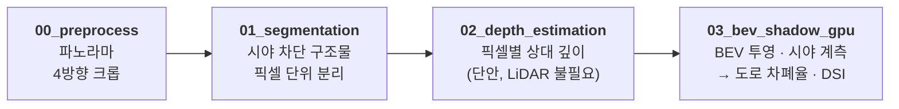
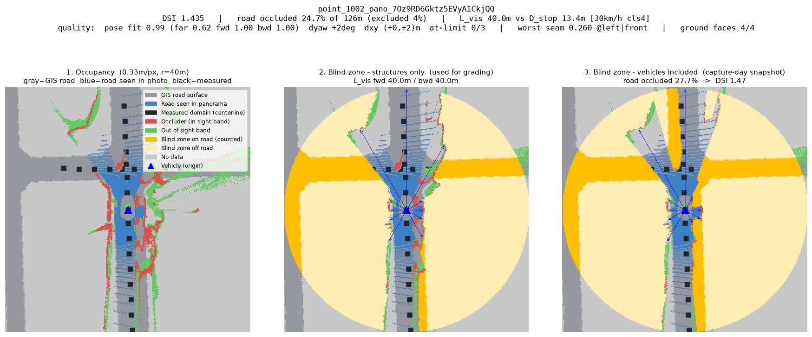

<div align="center">

**[5kph] 2026 강릉 ITS 세계총회 유스펠로우쉽**

# 안전성·수요 기반 자율주행 셔틀 노선 설계를 위한 인지 음영 지수(DSI) 모델

**DSI 웹 지도 → [its-2026.vercel.app](https://its-2026.vercel.app/)**
분석지 도로망의 DSI 등급과 지점별 진단 결과를 지도에서 바로 확인하실 수 있습니다.

</div>

---

## 프로젝트 요약

강릉시의 네이버 스트리트뷰 사진 36,367장에 대해 컴퓨터 비전을 이용한 자율주행 버스 노선 사전 안전성 진단을 수행하고, 이를 관광 수요예측과 결합하여 안전성과 수요를 모두 충족하는 노선을 검증·설계하는 것을 목표로 합니다.

## 아이디어 필요성

현재 주류 방식인 HD·LiDAR 기반 3D 매핑은 구축 비용이 크고 갱신 주기가 길어 강릉시 전역이나 벽지노선형까지 반복 적용하기 어렵습니다. 기존 정적 위험도 분석도 사고 이력이나 전문가 현장조사에 의존하는 사후적·정성적 평가에 그쳐 노선 계획 단계에서는 활용할 수 없다는 한계가 있습니다.

본 프로젝트의 핵심은 인지 음영 지수를 단순 진단 지표가 아닌 노선 검증·설계 도구로 격상시키는 데 있습니다. 산출된 인지 음영 지수를 기준으로 현재 운행 중인 노선의 구간별 위험도를 진단·검증하고 고위험 구간을 회피하는 대안 노선이나 신규 노선을 직접 제안할 수 있어, 노선 계획자가 안전성 제고와 노선 설계라는 목표를 동시에 추진할 수 있는 근거를 제공합니다.

또한 관광 셔틀은 축제 기간 교통 수요 분산이라는 현실적 목적을 함께 고려해야 하므로, 안전 진단에 그치지 않고 관광 수요예측과 결합합니다. 이를 통해 안전성과 수요를 동시에 충족하는 노선 후보를 제시하는 데까지 나아갑니다.

---

## 전체 구성과 본 저장소의 범위

제안서의 파이프라인은 여섯 단계로 구성됩니다. 해당 깃헙 저장소는 그중 **안전성 축(1~4단계)의 구현체**이며, 수요 축(5·6단계)은 별도 작업으로 진행됩니다.

<div align="center">

| 단계 | 내용 | 본 저장소 |
|:---:|:---|:---:|
| **1** | 시맨틱 세그멘테이션 기반 정적 인프라 객체 분리 | ● 구현 |
| **2** | 단안 깊이 추정을 통한 거리 정보 복원 | ● 구현 |
| **3** | BEV 투영 및 사각지대 정량 계측 | ● 구현 |
| **4** | 교통공학적 변수 융합 및 DSI 산출 | ● 구현 |
| 5 | 다변량 시계열(SARIMAX) 기반 관광 수요예측 | ○ 별도 |
| 6 | 안전성·수요 결합 그래프 기반 노선 최적화 | ○ 별도 |

</div>

즉 본 저장소의 최종 산출물은 **분석지 도로망 각 지점의 DSI 값과 그 근거 자료**이며, 이것이 6단계 노선 최적화의 엣지 가중치로 투입됩니다.

### 입력 데이터

| 구분 | 내용 |
|:---|:---|
| **스트리트뷰** | 네이버 로드뷰 파노라마 API, 분석지 전 도로망 5m 간격, **36,367지점** |
| **도로망** | 실폭도로 폴리곤 + 도로구간 중심선(노드화·5m 조밀화), EPSG:5179 |
| **카메라 정보** | 지점별 좌표·촬영 방위각·리그 높이(2.0 / 2.5 / 3.0 m) |

---

## DSI 산출 파이프라인



각 단계는 주피터 노트북 하나에 대응하며, 앞 단계의 산출 파일을 뒷 단계가 입력으로 받습니다.

<br/>

### 0단계 — 파노라마 전처리 (`00_preprocess.ipynb`)

360° 파노라마는 좌·정면·우·후방·바닥·하늘 순으로 수평 6등분되어 있습니다. 이 중 시야 분석에 쓰이는 앞의 네 구간(각 90°)만 잘라 내어 방향별 크롭 이미지로 저장합니다. 인식 모델은 원근 투영 영상으로 학습되어 있어, 왜곡이 큰 등장방형 원본보다 90° 핀홀 크롭에서 정확도가 높습니다.

> 파노라마 36,367장 → 방향별 크롭 145,468장
>
> 원본 파노라마 예시 이미지는 [네이버 스트리트뷰 파노라마](https://panorama.pstatic.net/image/7Oz9RD6Gktz5EVyAICkjQQ/512/P)에서 직접 확인하실 수 있습니다.

<br/>

### 1단계 — 시맨틱 세그멘테이션 (`01_segmentation.ipynb`)

ADE20K(150클래스) 기반 **Mask2Former Swin-Large**로 각 크롭을 픽셀 단위 분류하고, 도로 맥락에 맞추어 세 계열의 마스크로 나눕니다.

| 마스크 | 대상 클래스 | 역할 |
|:---|:---|:---|
| **시야 차단 구조물** | 건물·벽·담장·가로수·기둥·표지판 등 **32종** | 사각지대를 만드는 주체 |
| **지면·하늘** | 도로·보도·잔디·하늘 등 | 시야를 막지 않음. 3단계 metric 보정의 기준면 |
| **차량** | 승용차·버스·트럭·이륜차 등 | 별도 마스크로 분리 보관 |

차량을 구조물과 분리하는 이유는 두 가지 해석이 모두 필요하기 때문입니다. 구조물만을 센 값은 **촬영일 교통과 무관한 그 장소의 구조적 속성이므로 노선 등급 산정에 사용**하고, 차량을 포함한 값은 촬영 순간의 실측치로 참고합니다.

<p align="center">
  
</p>

<sub>*(예시) 방향별 세그멘테이션 결과를 좌·정면·우·후방 순으로 이어붙인 사진. 건물·가로수 등 시야 차단 구조물은 클래스별 색으로, 차량은 주황색으로 표시됩니다.*</sub>

<br/>

### 2단계 — 단안 깊이 추정 (`02_depth_estimation.ipynb`)

**Depth Anything V2 Large**로 픽셀별 깊이 단서를 복원합니다. LiDAR 없이 공개 이미지만으로 거리 정보를 얻는 것이 본 파이프라인의 비용 우위를 만드는 지점입니다.

모델 출력은 값이 클수록 가까운 이격값이며, 추론 1회마다 미지의 (scale, shift)를 갖는 아핀(affine; 평행이동, 회전, 크기 조절 등을 적용해도 값이 변하지 않고 그대로 유지되는 성질을 가지는) 불변량입니다. 즉 이 단계의 결과는 "어느 쪽이 더 가까운가"까지만 말해 주고 절대 거리는 아직 확정되지 않습니다. 따라서 중간 정규화 없이 원출력을 float16으로 그대로 저장하고, 미터 환산은 3단계에서 기하 제약으로 풉니다.

<p align="center">
  
</p>

<sub>*(예시) 같은 지점의 방향별 깊이 시각화. 어두울수록 가깝고 밝을수록 멉니다. 화면 하단의 짙은 영역은 촬영 차량의 보닛입니다.*</sub>

<br/>

### 3단계 — BEV 투영 및 시야 계측 (`03_bev_shadow_gpu.ipynb`)

앞의 두 단계가 "무엇이 찍혔는가"와 "어느 쪽이 더 가까운가"를 알려 주었다면, 이 단계는 그것을 실제 미터 단위의 평면도로 바꿉니다. 그 지점 위에서 내려다본 조감도(BEV, Bird's Eye View)를 그리고, 그 위에서 **차에서 보이지 않는 도로가 얼마나 되는지**를 잽니다.

**① 미터로 환산하기.**
2단계 결과는 아직 배율이 정해지지 않은 상대값이므로, 실제 거리로 되돌릴 단서가 필요합니다. 여기에는 다음 두 가지 내용을 이용합니다. 첫째, **카메라 높이를 알면 화면 속 바닥이 몇 미터 앞인지 삼각측량으로 계산됩니다.** 둘째, **네 방향 사진이 맞닿는 이음매에서는 같은 물체가 양쪽에서 같은 거리로 나와야 합니다.** 이 두 조건을 동시에 만족하는 환산식을 파노라마 한 장마다 풀어, 네 면이 서로 어긋나지 않는 하나의 좌표계로 묶습니다. 카메라 높이는 추정하지 않고 네이버 스트리트뷰 메타데이터의 실측값(2.0 / 2.5 / 3.0 m)을 지점마다 그대로 씁니다.

**② 시야를 막는 것만 고르기.**
화면에 잡힌 모든 물체가 운전 시야를 가리는 것은 아닙니다. 그래서 **지면에서 1.0~3.0 m 높이**를 차지하는 것만 차단물로 인정합니다. 연석이나 낮은 화단은 그 너머가 보이고, 가로수의 우산처럼 퍼진 윗부분은 시선 위로 지나가기 때문입니다.

**③ 360° 시야 재기.**
카메라를 중심으로 원을 **720갈래(0.5° 간격)** 로 나누고, 각 갈래마다 시야가 처음 막히는 지점까지의 거리를 기록합니다. 제자리에서 레이저 거리계를 한 바퀴 돌린 것과 같으며, 결과는 방향별 가시거리 720개의 목록입니다. 이후 모든 지표는 이 목록 하나에서 나옵니다.

**④ 실제 도로 위에 얹기.**
파노라마 사진만 이용하여 복원한 도로면 지도를 만들고, GIS 실폭도로 폴리곤과 겹쳐 카메라의 위치·바라보는 방향 오차를 먼저 바로잡습니다. 그런 다음 **도로를 따라 40 m 이내**에 도달하는 구간만 계측 대상으로 삼습니다. 직선거리가 아니라 도로를 따라간 거리를 쓰는 이유는, 건물 뒤편처럼 애초에 차가 다니지 않는 곳까지 "안 보이는 영역"으로 세면 위험도가 부풀려지기 때문입니다.(건물 뒷쪽 마당이 자율주행 차량이 지나가는 건물 앞면 도로에서 보이지 않는 건 자율주행 차량 관점에서 위험이 아닙니다.)

**⑤ 계측.**
계측 대상 도로 중 ③의 시야에 가려지는 길이의 비율이 **도로 차폐율**이고, 정면·후방으로 시선이 처음 막히는 거리가 **유효 가시거리 `L_vis`** 입니다.

**⑥ 믿을 수 있는 결과만 사용.**
바닥이 거의 보이지 않아 ①의 환산이 성립하지 않는 경우, 앞차에 가려 도로의 절반 이상을 아예 관측하지 못한 경우, ④의 위치 보정이 수렴하지 않은 경우에는 값을 산출하지 않고 **판정 불가**로 남깁니다.

<p align="center">
  
</p>

<sub>*(예시) 왼쪽부터 (1) 조감도 — 회색은 GIS 실폭도로, 파랑은 파노라마 사진으로만 재현한 도로면, 검정은 차폐율을 세는 대상 구간입니다. 회색과 파랑이 잘 겹칠수록 위치 보정이 잘된 경우입니다. (2) 구조물만 있을 때의 사각지대, (3) 촬영 당시 주차·주행 차량까지 포함한 사각지대. 주황은 도로 위 사각지대(계수 대상), 연한 노랑은 도로 밖 사각지대입니다. 이 지점은 40 m 이내 도로 126 m 중 24.7%가 가려져 DSI 1.43(주의)으로 산정되었습니다.*</sub>

---

## 4단계 — DSI 산출 및 등급

구조적 사각지대에 도로의 운영 조건을 결합해 지점별 지수를 만듭니다.

```text
DSI = (1 + 도로 차폐율) × (1 + V_heavy)

  도로 차폐율 : 40 m 이내 도달 가능 도로 중 시야가 닿지 않는 길이의 비율 (0–1)
  V_heavy     : 해당 링크의 중차량 혼입률 (PoC 기본값 0.15)
```

여기에 **정지시거 지시함수**를 별도의 레드 플래그로 병행합니다. 도로 등급에서 제한속도를, 제한속도에서 필요 제동거리 `D_stop`을 산출하고 `L_vis`와 비교합니다.

<div align="center">

| 도로 등급 | 유형 | 제한속도 | `D_stop` |
|:---:|:---|---:|---:|
| 4 | 길(이면도로) | 30 km/h | 13.4 m |
| 3 | 로(일반도로) | 50 km/h | 27.9 m |
| 2 | 대로 | 60 km/h | 36.9 m |

</div>

`D_stop > L_vis`인 지점은 **즉시 대응이 불가능한 구간**으로 플래그 처리합니다. 이 지시함수를 DSI에 곱하지 않고 분리한 이유는, 두 항이 모두 "도로를 볼 수 있는가"를 재고 있어 곱하면 동일한 위험을 이중으로 계산하기 때문입니다. 연속 위험도(순위·등급용)와 이진 경보(즉시 조치용)를 나누어 제시합니다.

산출된 DSI는 전체 분포를 기준으로 **안전 / 주의 / 고위험** 세 구간으로 등급화하며, 이는 6단계 노선 최적화에서 회피·개선·우선경유 판단의 입력값이 됩니다.

---

## 산출물

지점마다 다음이 생성됩니다.

- **BEV 진단 이미지** — 3패널
  1. 점유 격자: GIS 실폭도로(회색) 위에 사진이 본 도로면(파랑)을 겹쳐, 정합 품질을 그림만으로 검증할 수 있게 했습니다
  2. 구조물 기준 사각지대 — 등급 산정에 사용
  3. 차량 포함 사각지대 — 촬영일 스냅숏 (가장 정직한 결과)
- **계측 JSON** — DSI·등급, 도로 차폐율(구조물/차량 기준), `L_vis` 전·후방 분해, 정지시거 플래그, 보정·정합 품질 지표, 판정 가능 여부
- **방사 프로파일 `r(θ)`** — 계측 도메인을 바꾸는 후속 실험을 전량 재실행 없이 수행하기 위한 중간 산출물

전량을 [웹 지도](https://its-2026.vercel.app/)(`web/`)로 배포합니다. 지도에서 지점을 선택하면 DSI 등급, 스트리트뷰 원본, 세그멘테이션·깊이 시각화, BEV 진단 이미지를 함께 확인할 수 있습니다.

---

## 저장소 구조

```text
00_preprocess.ipynb          0단계 · 파노라마 4방향 크롭
01_segmentation.ipynb        1단계 · 시맨틱 세그멘테이션
02_depth_estimation.ipynb    2단계 · 단안 깊이 추정
03_bev_shadow_gpu.ipynb      3·4단계 · BEV 투영과 DSI 산출
bev/                         3단계 계산 헬퍼 모듈 (보정·프로파일·지표·렌더·도로망 전처리)
GIS/                         도로망, 실폭도로 폴리곤, 지점별 카메라 정보
web/                         결과 열람용 웹 지도
method.md                    설계 근거·실험 기록
```

---

## 주요 변경 사항

파이프라인을 발전시키면서 제안서의 초기 설계에서 수정한 부분이 있고, 계속 수정될 예정입니다. 시행 착오 및 수정 내용과 그 근거는 [method.md](method.md)에 기록해 두었습니다.

| 항목 | 제안서 | 현재 |
|:---|:---|:---|
| **세그멘테이션 모델** | SegFormer (ADE20K) | Mask2Former Swin-L (ADE20K) — 기둥·가장자리 등 미세 구조 분리 개선 |
| **분석 시야** | 정면 중심 | 좌·정면·우·후방 4방향 통합 360° |
| **사각지대 도메인** | 원판 면적비 `A_shadow / A_total` | 도로를 따라 40 m 이내인 **도로 구간의 차폐율** |
| **정지시거 결합** | DSI에 지시함수를 곱함 | 연속 위험도와 이진 플래그를 **분리** |
| **제한속도** | 링크 단일 값 | 도로 등급별 30 / 50 / 60 km/h |
| **결측 처리** | — | 보정·정합이 성립하지 않으면 **판정 불가**로 명시 |

설계 결정의 근거, 파라미터 선정 실험, 기각된 가설과 그 사유 또한 [method.md](method.md)에 정리되어 있습니다. 현재 진행 상태 역시 해당 문서의 첫 절에서 확인하실 수 있습니다.

---

## 사용 도구 및 데이터

### 데이터 · 외부 API

| 도구 · API | 용도 |
|:---|:---|
| **네이버 로드뷰 파노라마 API** | 분석 대상 스트리트뷰 파노라마 36,367지점 수집 (5m 간격) |
| **네이버 지도 거리뷰** | 웹 지도에서 선택한 지점의 실제 거리뷰로 연결 |
| **Google Drive API (v3)** | 세그멘테이션·깊이·BEV 결과 이미지 저장 및 웹 서빙 |
| **rclone** | 로컬 산출물을 Google Drive로 병렬 업로드 |
| **GitHub API** | 웹에서 저장소의 문서(`README.md`·`method.md`) 원문을 불러와 표시 |
| **OpenStreetMap · CARTO** | 웹 지도 베이스맵 타일 |
| **국가공간정보 실폭도로 · 도로구간** | 도로 폴리곤과 중심선, 도로 등급(대로·로·길) |

### AI 모델 · 에이전트

| 도구 | 용도 |
|:---|:---|
| **Mask2Former Swin-Large (ADE20K)** | 1단계 시맨틱 세그멘테이션 (Hugging Face `transformers`) |
| **Depth Anything V2 Large** | 2단계 단안 깊이 추정 |
| **Claude Opus (Claude Code)** | 파이프라인 구현·검증 실험·문서화를 수행한 코딩 에이전트 |
| **Claude Sonnet · Gemini Flash** | 제안 단계의 아이디어 브레인스토밍 및 방법론 구조화 |

### 분석 · 처리 스택

| 도구 | 용도 |
|:---|:---|
| **Python · Jupyter Notebook** | 파이프라인 전 단계의 실행 환경 |
| **PyTorch (CUDA)** | GPU 추론 |
| **NumPy · SciPy · pandas** | 보정·방사 프로파일·지표 계산, 결과 집계 |
| **OpenCV · matplotlib** | 이미지 처리, BEV 진단 이미지 렌더링 |
| **GeoPandas · Shapely · pyproj** | 도로망 전처리, 좌표계 변환(EPSG:5179) |
| **QGIS** | GIS 데이터 준비 및 결과 공간 검토 |

### 웹 배포

| 도구 | 용도 |
|:---|:---|
| **Next.js · React · TypeScript** | 결과 열람용 웹 애플리케이션 |
| **Leaflet · react-leaflet** | DSI 등급 지도 및 지점 마커 |
| **react-markdown · remark-gfm** | 저장소 문서를 웹에서 렌더링 |
| **Vercel** | 웹 지도 배포 — [its-2026.vercel.app](https://its-2026.vercel.app/) |

### 라이선스

이 저장소의 **코드와 문서는 [MIT License](LICENSE)** 를 따릅니다.

다만 파이프라인이 사용하는 모델·라이브러리·지도 데이터·스트리트뷰 이미지는 각자의 조건이 있어 MIT의 적용 대상이 아닙니다. 특히 2단계의 **Depth Anything V2 Large는 CC BY-NC 4.0(비상용 전용)** 이므로 상용 이용 시 모델 교체가 필요합니다. 전체 목록과 조건은 [NOTICE](NOTICE)에 정리해 두었습니다.

원본 파노라마는 네이버 로드뷰 저작물이므로 이 저장소에 포함하지 않습니다.

### 5·6단계 예정 (별도 진행)

| 도구 · API | 용도 |
|:---|:---|
| **한국관광공사 TourAPI (DataLabService)** | 일자별 외지인 방문자수 — 관광 수요 시계열 |
| **기상청 API · 한국천문연구원 특일정보 API** | 기온·강수·공휴일 등 수요예측 외생변수 |
| **강릉시 ITS 교통정보 조회서비스 API** | 교차로 횡단 보행자수 — 정류장별 공간 가중치 |
| **statsmodels (SARIMAX)** | 계절성·외생변수를 반영한 관광 수요예측 |
| **NetworkX** | 안전성·수요 결합 그래프 기반 노선 최적화 |
